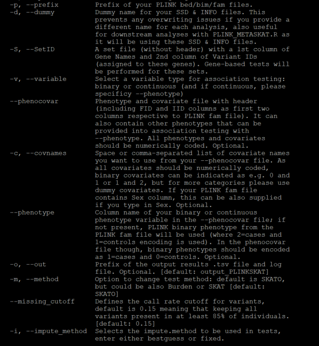
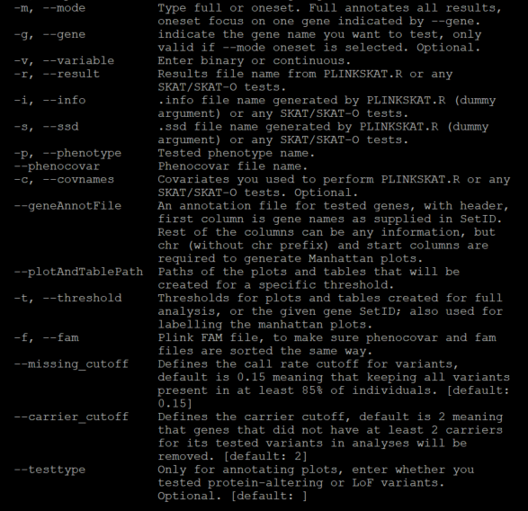
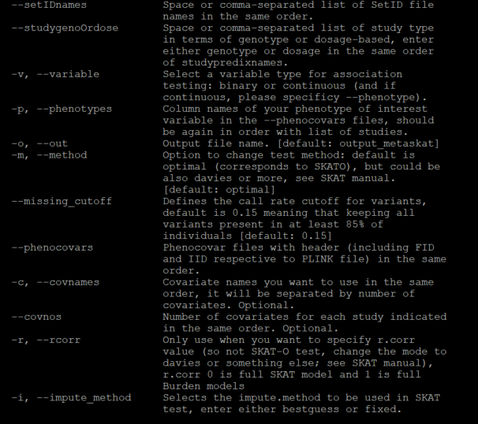
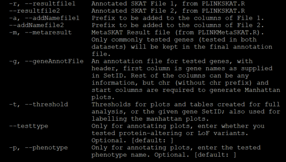

# AD Biomarkers Rare Variant Analyses - Analysis Scripts

------

Analysis scripts of the gene-based rare variant association studies (RVASs) conducted for the study [**"Whole-exome rare variant analysis of Alzheimer’s disease and related biomarker traits"**](https://alz-journals.onlinelibrary.wiley.com/doi/10.1002/alz.12842) by Küçükali _et al._, Alzheimer's and Dementia (2022), https://doi.org/10.1002/alz.12842 .

------

## Table of Contents

1. [Analysis Scripts](#1)
    1.1. [Required R packages](#2)
    1.2. [PLINKSKAT.R](#3)
    1.3. [Annotate_PLINKSKAT_Results.R](#4)
    1.4. [PLINKMetaSKAT.R](#5)
    1.5. [Annotate_PLINKMetaSKAT_Results.R](#6)
2. [Examples](#7)
    2.1. [Simulated Genetic and Phenotypic Data](#8)
    2.2. [Gene-based RVAS for Binary Traits](#9)
    2.3. [Gene-based RVAS for Continuous Traits](#10)

## Analysis Scripts <a name="1"></a>

We developed two gene-based RVAS scripts ([**PLINKSKAT.R**](https://github.com/SleegersLab-VIBCMN/AD_Biomarkers_RareVariantAnalyses/tree/main/analysis_scripts/PLINKSKAT.R) & [**PLINKMetaSKAT.R**](https://github.com/SleegersLab-VIBCMN/AD_Biomarkers_RareVariantAnalyses/tree/main/analysis_scripts/PLINKMetaSKAT.R)) based on [**SKAT**](https://cran.r-project.org/web/packages/SKAT/index.html) and [**MetaSKAT**](https://cran.r-project.org/web/packages/MetaSKAT/index.html) packages in R and [PLINK](https://www.cog-genomics.org/plink/) format genetic data files, accompanied with [**argparser**](https://cran.r-project.org/web/packages/argparser/index.html) to facilitate running gene-based RVAS with different modes and options from the command line.

For annotation and visualization of the generated results, we also developed two additional Rscripts ([**Annotate_PLINSKAT_Results.R**](https://github.com/SleegersLab-VIBCMN/AD_Biomarkers_RareVariantAnalyses/tree/main/analysis_scripts/Annotate_PLINKSKAT_Results.R) & [**Annotate_PLINKMetaSKAT_Results.R**](https://github.com/SleegersLab-VIBCMN/AD_Biomarkers_RareVariantAnalyses/tree/main/analysis_scripts/Annotate_PLINKMetaSKAT_Results.R)) that can also be customized with different modes and options from the command line.

For each R script, `--help` displays all available modes and options, lists all arguments, and provides detailed information.

### Required R Packages <a name="2"></a>

Below is a list of required R packages for running four R scripts, together with their versions we have used:

```sh
R v4.2.0, required R Packages:
- SKAT # v2.0.1 - for analyses in the paper; tested also the latest version v2.2.4 - works fine and reproduces the same results
- MetaSKAT # v0.81 - for analyses in the paper; tested also the latest version v0.82 - works fine and reproduces the same results
- argparser # v0.7.1
- dplyr # v1.0.10
- data.table # v1.14.4
- ggplot2 # v3.3.6
- ggrepel # v0.9.1
- ggbeeswarm # v0.6.0
- scales # v1.2.1
- qqman # v0.1.8
- rmeta # v3.0
```

### PLINKSKAT.R <a name="3"></a>




### Annotate_PLINKSKAT_Results.R <a name="4"></a>

mkdir tables_and_plots




### PLINKMetaSKAT.R <a name="5"></a>

For dosages, you have to create a file with:

bcftools query -f "%ID\t%REF\t%ALT[\t%DS]\n" testdata.vcf.gz > testdata.dosage

It should be named as PLINK prefix.





### Annotate_PLINKMetaSKAT_Results.R <a name="6"></a>




## Examples <a name="7"></a>

Below we provide examples for gene-based RVAS using these Rscripts based on a simulated genetic data and dummy phenotypic values.

### Simulated Genetic and Phenotypic Data <a name="8"></a>

Using PLINK2, we can generate simulated genetic data for two cohorts.

**Cohort 1**

```bash
plink2 --dummy 300 600000 acgt --out simulatedGeneticData1 --make-bed
plink --bfile simulatedGeneticData1 --make-bed --max-maf 0.01 --out rareVariants_simulatedGeneticData1
```

This generates a simulated rare variant genetic data on 300 subjects (147 cases and 153 controls) and 13229 markers on chr1. PLINK format file prefix is **rareVariants_simulatedGeneticData1**.

We group them into 1322 genes, each having about 10 consecutive markers -> file is called **simulatedGeneticData1_SetID**

We also create a phenocovar file **simulatedGeneticData1_phenocovar.tsv** with BinaryPheno1, ContPheno1, binaryCov1, binaryCov2, contCov1, contCov2 columns for each individual.

**Cohort 2**  

```bash
plink2 --dummy 200 600000 acgt --out simulatedGeneticData2 --make-bed
plink --bfile simulatedGeneticData2 --make-bed --max-maf 0.01 --out rareVariants_simulatedGeneticData2
```

This generates a simulated rare variant genetic data on 200 subjects (97 cases and 103 controls) and 14366 markers on chr1. PLINK format file prefix is **rareVariants_simulatedGeneticData2**.

We group them into 1437 genes, each having about 10 consecutive markers (and for meta-analysis purposes, we assume that GeneX from cohort1 corresponds to GeneX in cohort2 as well) -> file is called **simulatedGeneticData2_SetID**.

We also create a phenocovar file **simulatedGeneticData2_phenocovar.tsv** with BinaryPheno1, ContPheno1, binaryCov1, binaryCov2, contCov1, contCov2 columns for each individual.

### Gene-based RVAS for Binary Traits <a name="8"></a>

```bash
Rscript PLINKSKAT.R --prefix rareVariants_simulatedGeneticData1 --dummy cohort1_binarySKATO_wCov --SetID simulatedGeneticData1_SetID --variable binary --phenocovar simulatedGeneticData1_phenocovar.tsv --phenotype BinaryPheno1 --out cohort1_binarySKATO_wCov_results --covnames binaryCov1 binaryCov2 contCov1 contCov2 --impute_method bestguess --method SKATO --missing_cutoff 0.15
```

```bash
Rscript PLINKSKAT.R --prefix rareVariants_simulatedGeneticData2 --dummy cohort2_binarySKATO_wCov --SetID simulatedGeneticData2_SetID --variable binary --phenocovar simulatedGeneticData2_phenocovar.tsv --phenotype BinaryPheno1 --out cohort2_binarySKATO_wCov_results --covnames binaryCov1 binaryCov2 contCov1 contCov2 --impute_method bestguess --method SKATO --missing_cutoff 0.15
```

```bash
mkdir tables_and_plots
```

```bash
Rscript Annotate_PLINKSKAT_Results.R --mode full --variable binary --result cohort1_binarySKATO_wCov_results.tsv --info cohort1_binarySKATO_wCov.info --ssd cohort1_binarySKATO_wCov.ssd --phenotype BinaryPheno1 --phenocovar simulatedGeneticData1_phenocovar.tsv --covnames binaryCov1 binaryCov2 contCov1 contCov2 --fam rareVariants_simulatedGeneticData1.fam --geneAnnotFile geneAnnotFile.tsv --plotAndTablePath tables_and_plots/ --threshold 0.005 --missing_cutoff 0.15 --carrier_cutoff 2 --testtype LoF
```

```bash
Rscript Annotate_PLINKSKAT_Results.R --mode full --variable binary --result cohort2_binarySKATO_wCov_results.tsv --info cohort2_binarySKATO_wCov.info --ssd cohort2_binarySKATO_wCov.ssd --phenotype BinaryPheno1 --phenocovar simulatedGeneticData2_phenocovar.tsv --covnames binaryCov1 binaryCov2 contCov1 contCov2 --fam rareVariants_simulatedGeneticData2.fam --geneAnnotFile geneAnnotFile.tsv --plotAndTablePath tables_and_plots/ --threshold 0.005 --missing_cutoff 0.15 --carrier_cutoff 2 --testtype LoF
```

```bash
Rscript PLINKMetaSKAT.R --studygenoOrdose genotype genotype --variable binary --phenotypes BinaryPheno1 BinaryPheno1 --studyprefixnames rareVariants_simulatedGeneticData1 rareVariants_simulatedGeneticData2 --setIDnames simulatedGeneticData1_SetID simulatedGeneticData2_SetID --phenocovars simulatedGeneticData1_phenocovar.tsv simulatedGeneticData2_phenocovar.tsv --covnames binaryCov1 binaryCov2 contCov1 contCov2 binaryCov1 binaryCov2 contCov1 contCov2 --covnos 4 4 --out binaryMetaSKATO_wCov_results --impute_method bestguess
```

```bash
Rscript Annotate_PLINKMetaSKAT_Results.R --resultfile1 ANNOTATED.cohort1_binarySKATO_wCov_results.tsv --resultfile2 ANNOTATED.cohort2_binarySKATO_wCov_results.tsv --addNamefile1 cohort1 --addNamefile2 cohort2 --metaresult binaryMetaSKATO_wCov_results.tsv --geneAnnotFile geneAnnotFile.tsv --threshold 0.0005 --testtype LoF --phenotype BinaryPheno1
```

### Gene-based RVAS for Continuous Traits <a name="9"></a>

```bash
Rscript PLINKSKAT.R --prefix rareVariants_simulatedGeneticData1 --dummy cohort1_continuousSKATO_wCov --SetID simulatedGeneticData1_SetID --variable continuous --phenocovar simulatedGeneticData1_phenocovar.tsv --phenotype ContPheno1 --out cohort1_continuousSKATO_wCov_results --covnames binaryCov1 binaryCov2 contCov1 contCov2 --impute_method fixed --method SKATO --missing_cutoff 0.15
```

```bash
Rscript PLINKSKAT.R --prefix rareVariants_simulatedGeneticData2 --dummy cohort2_continuousSKATO_wCov --SetID simulatedGeneticData2_SetID --variable continuous --phenocovar simulatedGeneticData2_phenocovar.tsv --phenotype ContPheno1 --out cohort2_continuousSKATO_wCov_results --covnames binaryCov1 binaryCov2 contCov1 contCov2 --impute_method fixed --method SKATO --missing_cutoff 0.15
```

```bash
mkdir tables_and_plots
```

```bash
Rscript Annotate_PLINKSKAT_Results.R --mode full --variable continuous --result cohort1_continuousSKATO_wCov_results.tsv --info cohort1_continuousSKATO_wCov.info --ssd cohort1_continuousSKATO_wCov.ssd --phenotype ContPheno1 --phenocovar simulatedGeneticData1_phenocovar.tsv --covnames binaryCov1 binaryCov2 contCov1 contCov2 --fam rareVariants_simulatedGeneticData1.fam --geneAnnotFile geneAnnotFile.tsv --plotAndTablePath tables_and_plots/ --threshold 0.005 --missing_cutoff 0.15 --carrier_cutoff 2 --testtype LoF
```

```bash
Rscript Annotate_PLINKSKAT_Results.R --mode full --variable continuous --result cohort2_continuousSKATO_wCov_results.tsv --info cohort2_continuousSKATO_wCov.info --ssd cohort2_continuousSKATO_wCov.ssd --phenotype ContPheno1 --phenocovar simulatedGeneticData1_phenocovar.tsv --covnames binaryCov1 binaryCov2 contCov1 contCov2 --fam rareVariants_simulatedGeneticData1.fam --geneAnnotFile geneAnnotFile.tsv --plotAndTablePath tables_and_plots/ --threshold 0.005 --missing_cutoff 0.15 --carrier_cutoff 2 --testtype LoF
```


Rscript PLINKMetaSKAT.R --studygenoOrdose genotype genotype --variable continuous --phenotypes ContPheno1 ContPheno1 --studyprefixnames rareVariants_simulatedGeneticData1 rareVariants_simulatedGeneticData2 --setIDnames simulatedGeneticData1_SetID simulatedGeneticData2_SetID --phenocovars simulatedGeneticData1_phenocovar.tsv simulatedGeneticData2_phenocovar.tsv --covnames binaryCov1 binaryCov2 contCov1 contCov2 binaryCov1 binaryCov2 contCov1 contCov2 --covnos 4 4 --out continuousMetaSKATO_wCov_results --impute_method fixed
```

```bash
Rscript Annotate_PLINKMetaSKAT_Results.R --resultfile1 ANNOTATED.cohort1_continuousSKATO_wCov_results.tsv --resultfile2 ANNOTATED.cohort2_continuousSKATO_wCov_results.tsv --addNamefile1 cohort1 --addNamefile2 cohort2 --metaresult continuousMetaSKATO_wCov_results.tsv --geneAnnotFile geneAnnotFile.tsv --threshold 0.0005 --testtype LoF --phenotype ContPheno1
```


