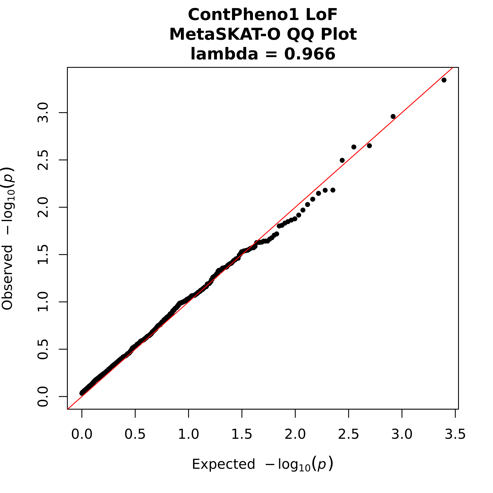

# AD Biomarkers Rare Variant Analyses - Analysis Scripts

------

Analysis scripts of the gene-based rare variant association studies (RVASs) conducted for the paper [**"Whole-exome rare variant analysis of Alzheimer’s disease and related biomarker traits"**](https://alz-journals.onlinelibrary.wiley.com/doi/10.1002/alz.12842) by Küçükali _et al._, Alzheimer's and Dementia (2022), https://doi.org/10.1002/alz.12842 .

------

## Table of Contents

1. [Analysis Scripts](#1)  
    1.1. [Required R Packages and Installation](#2)  
    1.2. [PLINKSKAT.R](#3)  
    1.3. [Annotate_PLINKSKAT_Results.R](#4)  
    1.4. [PLINKMetaSKAT.R](#5)  
    1.5. [Annotate_PLINKMetaSKAT_Results.R](#6)  
2. [Examples](#7)  
    2.1. [Simulated Genetic and Phenotypic Data](#8)  
    2.2. [Gene-based RVAS for Binary Traits](#9)  
    2.3. [Gene-based RVAS for Continuous Traits](#10)  

## Analysis Scripts <a name="1"></a>

We developed two gene-based RVAS scripts ([**PLINKSKAT.R**](https://github.com/SleegersLab-VIBCMN/AD_Biomarkers_RareVariantAnalyses/tree/main/analysis_scripts/PLINKSKAT.R) & [**PLINKMetaSKAT.R**](https://github.com/SleegersLab-VIBCMN/AD_Biomarkers_RareVariantAnalyses/tree/main/analysis_scripts/PLINKMetaSKAT.R)) based on [**SKAT**](https://cran.r-project.org/web/packages/SKAT/index.html) and [**MetaSKAT**](https://cran.r-project.org/web/packages/MetaSKAT/index.html) packages in R and [PLINK](https://www.cog-genomics.org/plink/) format genetic data files, accompanied with [**argparser**](https://cran.r-project.org/web/packages/argparser/index.html) to facilitate running gene-based RVAS with different modes and options from the command line.

For annotation and visualization of the generated results, we also developed two additional Rscripts ([**Annotate_PLINSKAT_Results.R**](https://github.com/SleegersLab-VIBCMN/AD_Biomarkers_RareVariantAnalyses/tree/main/analysis_scripts/Annotate_PLINKSKAT_Results.R) & [**Annotate_PLINKMetaSKAT_Results.R**](https://github.com/SleegersLab-VIBCMN/AD_Biomarkers_RareVariantAnalyses/tree/main/analysis_scripts/Annotate_PLINKMetaSKAT_Results.R)) that can also be customized with different modes and options from the command line.

For each R script, `--help` displays all available modes and options, lists all arguments, and provides detailed information.

### Required R Packages and Installation <a name="2"></a>

Below is a list of required R packages for running four R scripts, together with their versions we have used:

```sh
R v4.2.0, required R Packages:
- SKAT # v2.0.1 - for analyses in the paper; tested also the latest version v2.2.4 - works fine and reproduces the same results
- MetaSKAT # v0.81 - for analyses in the paper; tested also the latest version v0.82 - works fine and reproduces the same results
- argparser # v0.7.1
- dplyr # v1.0.10
- data.table # v1.14.4
- ggplot2 # v3.3.6
- ggrepel # v0.9.1
- ggbeeswarm # v0.6.0
- scales # v1.2.1
- qqman # v0.1.8
- rmeta # v3.0
```

You can use the provided [`conda`](https://docs.conda.io/projects/conda/en/latest/user-guide/install/linux.html) environment file [**environment_plinkskat.yml**](https://github.com/SleegersLab-VIBCMN/AD_Biomarkers_RareVariantAnalyses/tree/main/analysis_scripts/environment_plinkskat.yml) to create an environment and load these packages in this environment. You can also clone the repository and add the R scripts into this environment:

```sh
git clone https://github.com/SleegersLab-VIBCMN/AD_Biomarkers_RareVariantAnalyses.git
conda env create -f analysis_scripts/environment_plinkskat.yml
conda activate plinkskat
ln -s analysis_scripts/*.R ~/miniconda3/envs/plinkskat/bin/.
```

Or alternatively, using [`mamba`](https://mamba.readthedocs.io/en/latest/installation.html):

```sh
git clone https://github.com/SleegersLab-VIBCMN/AD_Biomarkers_RareVariantAnalyses.git
mamba env create -f environment_plinkskat.yml
mamba activate plinkskat
ln -s analysis_scripts/*.R ~/miniconda3/envs/plinkskat/bin/.
```

After this, you can execute the R scripts (PLINKSKAT.R, PLINKMetaSKAT.R, Annotate_PLINKSKAT_Results.R, and Annotate_PLINKMetaSKAT_Results.R) directly from the command line.

### PLINKSKAT.R <a name="3"></a>

This script runs gene-based RVAS based on SKAT package and PLINK format files. 

Inputs are: 

- A prefix of PLINK format bed/bim/fam genetic file, provided by `--prefix`
- A dummy name for intermediate files, provided by `--dummy`
- A SetID file describing gene names and variant IDs, provided by `--SetID`
- A "phenocovar" file containing phenotypes and covariates (if any), provided by `--phenocovar` 

Modes include:

- Selecting whether the phenotype is binary or continuous (using `--variable`)
- Indicating phenotype name with `--phenotype`
- Selecting among SKATO, Burden, or SKAT tests (using `--method`)
- Selecting an imputation method for remaining missing genotypes (using `--impute_method`; in most cases SKAT package recommends `bestguess` for binary traits and `fixed` for continuous traits, see SKAT manual)

Optionally:

- Selecting a missingness call rate cutoff for variants (using `--missing_cutoff`; default is 0.15)
- A list of covariates to be included in association testing (using `--covnames`) 
- An output file name (using `--output`)

**Description of the results file columns are described in below section for Annotate_PLINKSKAT_Results.R, as the annotated output contains the same columns**.


### Annotate_PLINKSKAT_Results.R <a name="4"></a>

This script runs annotation and visualization of results generated by PLINKSKAT.R script.

Inputs are:

- A result file (output of PLINKSKAT.R), provided by `--result`
- ssd & info file names, provided by `--ssd` and `--info` respectively, that were dummy names provided in PLINKSKAT.R for intermediate files
- The `--phenocovar`, `--phenotype`, `--variable`, `--covnames` (if used), `--missing_cutoff` arguments, and importantly, exactly same as the ones provided for PLINKSKAT.R previously

Additionally, other required arguments are:

- Mode for annotation, provided by `--mode`, either "full" or "oneset". Full annotates all results, oneset focus on one gene indicated by `--gene`.
- PLINK fam file should be provided with `--fam`
- An annotation file for tested genes should be provided with `--geneAnnotFile`. This can contain any information you want to add to the annotated results file, the only required columns are chr (without prefix) and start columns describing the position of the genes on genome, this is required for generating Manhattan plots.
- A path for additional plots and tables generated should be provided with `--plotAndTablePath`. This will generate detailed gene-specific tables for any association passing the threshold (indicated by `--threshold`) that can be used for downstream analyses, and also for continuous traits it generates a violin plot of values across mutation non-carriers and carriers for this gene and model. **Importantly, if this will be a subdirectory, make sure that that subdirectory is already created and path exists.**
- A significance threshold should be provided with `--threshold`. This will not be used to annotate the significance of results, but it is only used to annotate gene names on Manhattan plots, as genes with p-values below this threshold will be annotated on the Manhattan plot. Likewise, for these genes passing the threshold will be also included in gene-specific tables and plots under the subdirectory indicated by `--plotAndTablePath`.

Optionally:

- Carrier cutoffs (with `--carrier_cutoff`): This defines "a carrier cutoff" for association results. Default is 2, meaning that the genes that did not have at least 2 carriers for its tested variants in PLINKSKAT.R analyses will be removed.
- Test type, or any additional name you want to include in your Manhattan plots, QQ plots, and continuous trait gene-specific plots, with `--testtype`. You can for instance indicate whether you tested protein-altering or LoF variants. If not provided, default is blank.
- Name of the gene to annotate the results for, if `--mode` is set as "oneset", provided by `--gene`.


**Description of output file columns for binary traits**:

| **Column**                    | **Description**                                                                                                                                                  |
|----------------------------|--------------------------------------------------------------------------------------------------------------------------------------------------------------|
| SetID                      | Tested gene                                                                                                                                                  |
| P.value                    | p-value of association, as reported by SKAT                                                                                                                  |
| N.Marker.All               | Number of markers within the gene, as reported by SKAT                                                                                                       |
| N.Marker.Test              | Number of tested markers within the gene, as reported by SKAT                                                                                                |
| MAC                        | Minor allele count (total), as reported by SKAT only for binary phenotypes                                                                                   |
| m                          | Number of carriers (total), as reported by SKAT only for binary phenotypes                                                                                   |
| Method.bin                 | Type of method to compute a p-value, as reported by SKAT                                                                                                     |
| MAP                        | Minimum possible p-values (MAP) as reported by SKAT                                                                                                          |
| cases_cMAC                 | Cumulative minor allele count (cMAC) in cases                                                                                                                |
| cases_cMAF                 | Cumulative minor allele frequency (cMAF) in cases; also takes into account missingness                                                                       |
| controls_cMAC              | Cumulative minor allele count (cMAC) in controls                                                                                                             |
| controls_cMAF              | Cumulative allele frequency (cMAF) in controls; also takes into account missingness                                                                          |
| no_of_carriers             | Total number of mutation carriers                                                                                                                            |
| enrichment_ratio           | Enrichment ratio as calculated by cMAF in cases divided by cMAF in controls                                                                                  |
| P_regression               | P-value obtained by logistic regression model in R GLM (similar to a burden test), phenotype versus mutation numbers in individuals, corrected by covariates |
| OR_noOfMutations           | Odds ratio (OR) reported for number of mutations for this gene, calculated in R                                                                                           |
| OR_L95                     | OR + 95% confidence interval (CI) reported for number of mutations for this gene, calculated in R                                                                                  |
| OR_U95                     | OR - 95% CI reported for number of mutations for this gene, calculated in R                                                                                  |
| eff_estimate               | Effect estimate (beta) reported for number of mutations for this gene, calculated in R                                                                       |
| eff_stdErr                 | Standard error of the beta reported for the number of mutations for this gene, calculated in R                                                               |
| chr                        | Chromosome number for the gene, provided by --geneAnnotTable file                                                                                            |
| start                      | Gene start coordinate, provided by --geneAnnotTable file                                                                                                     |
| …other annotation columns… | Other columns added by --geneAnnotatTable file                                                                                                               |
| exome_wide_check           | Informs whether the SKAT p-value is significant after Bonferroni correction for the number of genes tested (exome-wide : 0.05/n or suggestive : 1/n)         |

**Description of output file columns for continuous traits:**

| **Column**                     | **Description**                                                                                                                                                |
|----------------------------|------------------------------------------------------------------------------------------------------------------------------------------------------------|
| SetID                      | Tested gene                                                                                                                                                |
| P.value                    | p-value of association, as reported by SKAT                                                                                                                |
| N.Marker.All               | Number of markers within the gene, as reported by SKAT                                                                                                     |
| N.Marker.Test              | Number of tested markers within the gene, as reported by SKAT                                                                                              |
| cMAC                       | Cumulative minor allele count (cMAC)                                                                                                                       |
| cMAF                       | Cumulative minor allele count (cMAC)                                                                                                                       |
| medANDav_Pheno             | Median and average values of the phenotype tested, separated by "_"                                                                                        |
| Carriers_AvPheno           | Average phenotype value for the mutation carriers                                                                                                          |
| nonCarriers_AvPheno        | Average phenotype value for the mutation non-carriers                                                                                                      |
| AvDiff_Pheno               | Difference in mean phenotype value between carriers - noncarriers                                                                                          |
| Carriers_medianPheno       | Median phenotype value for the carriers                                                                                                                    |
| nonCarriers_medianPheno    | Median phenotype value for the non-carriers                                                                                                                |
| medianDiff_Pheno           | Difference in median phenotype value between carriers - noncarriers                                                                                        |
| no_of_carriers             | Total number of mutation carriers                                                                                                                          |
| P_regression               | P-value obtained by linear regression model in R GLM (similar to a burden test), phenotype versus mutation numbers in individuals, corrected by covariates |
| BETA_noOfMutations         | Beta reported for number of mutations for this gene, calculated in R                                                                                       |
| BETA_L95                   | Beta + 95% CI reported for number of mutations for this gene, calculated in R                                                                              |
| BETA_U95                   | Beta - 95% CI reported for number of mutations for this gene, calculated in R                                                                              |
| eff_estimate               | Effect estimate (beta) reported for number of mutations for this gene, calculated in R                                                                     |
| eff_stdErr                 | Standard error of the beta reported for the number of mutations for this gene, calculated in R                                                             |
| chr                        | Chromosome number for the gene, provided by --geneAnnotTable file                                                                                          |
| start                      | Gene start coordinate, provided by --geneAnnotTable file                                                                                                   |
| …other annotation columns… | Other columns added by --geneAnnotatTable file                                                                                                             |
| exome_wide_check           | Informs whether the SKAT p-value is significant after Bonferroni correction for the number of genes tested (exome-wide : 0.05/n or suggestive : 1/n)       |

### PLINKMetaSKAT.R <a name="5"></a>

This script runs gene-based RVAS meta-analysis based on MetaSKAT package and PLINK format files. It can meta-analyze two or more cohorts, and genetic data can be derived from genotype data or dosage data.

Inputs from each cohort should be either space or comma-separated list of below, must be in the **same order in the list**, and must include: 

- A list of prefixes of PLINK format bed/bim/fam genetic files to be meta-analyzed, provided by `--studyprefixnames`
- A list of SetID files describing gene names and variant IDs, provided by `--setIDnames`
- A list of variable types: either binary or continuous (using `--variable`)
- A list of phenocovar files, provided by `--phenocovars`
- A list of covariate names (if any; optional); provided by `--covnames`
- A list of two number, provided by `--covnos`, each indicating number of covariate each cohort has. For example, if "4 5", it would mean that first 4 covariates listed by `--covnames` belong to the first cohort, and remaining 5 belong to the second cohort.
- A list of phenotype names in the phenocovar files, provided by `--phenotypes`
- A list of genetic data type in terms of genotype or dosage-based study, enter either "genotype" or "dosage" in the argument `--studygenoOrdose`. If dosage, you have to create a file derived from for example a VCF with below bcftools code, and it should follow the same PLINK prefix as the other bed/bim/fam files:

```sh
bcftools query -f "%ID\t%REF\t%ALT[\t%DS]\n" testdata.vcf.gz > plinkprefix.dosage
```

Then, optionally:

- Selecting a missingness call rate cutoff for variants (using `--missing_cutoff`; default is 0.15).
- Selecting an imputation method for remaining missing genotypes (using `--impute_method`; in most cases MetaSKAT package recommends `bestguess` for binary traits and `fixed` for continuous traits, see MetaSKAT manual)
- Selecting a method for association test, provided by `--method`, default is "optimal" that corresponds to SKAT-O.
- Selecting r.corr value to define a specific rho value for SKAT, provided by `--rcorr`, default is NULL
- A list of covariates to be included in association testing (using `--covnames`), 
- An output file name (using `--out`).

Result files are .tsv files with two columns, indicating SetID gene name and MetaSKAT p-value.


### Annotate_PLINKMetaSKAT_Results.R <a name="6"></a>

This script runs annotation and visualization of results generated by PLINKMetaSKAT.R script, and combines also the annotated PLINKSKAT.R results in one file together with annotated meta-analysis results. Additionally, it also informs about estimated meta-analysis statistics derived from random effects and fixed effect models. Currently only for annotation of results from two cohorts.

Inputs are:

- Annotated SKAT results files (output of Annotate_PLINKSKAT_Results.R), provided by `--resultfile1` and `--resultsfile2`
- Prefix names to be added to the columns of annotated file 1 and 2 (a keyword that allows you to differentiate the two cohorts from each other, it will be added before the column name. This is to avoid presentation of same column name from the annotated SKAT result file). Provided by `--addNamefile1` and `--addNamefile2`
- A MetaSKAT result file (from PLINKMetaSKAT.R), provided by `--metaresult`
- An annotation file for tested genes should be provided with `--geneAnnotFile`. This can contain any information you want to add to the annotated results file, the only required columns are chr (without prefix) and start columns describing the position of the genes on genome, this is required for generating Manhattan plots.
- A significance threshold should be provided with `--threshold`. This will not be used to annotate the significance of results, but it is only used to annotate gene names on Manhattan plots, as genes with p-values below this threshold will be annotated on the Manhattan plot.

Optionally:

- Phenotype name or any additional name you want to include in your Manhattan plots and QQ plots, only for annotating plots, with `--phenotype`. You can for instance indicate the tested phenotypic trait name for the plots. If not provided, default is blank.
- Test type, or any additional name you want to include in your Manhattan plots and QQ plots, with `--testtype`. It will come after `--phenotype`. You can for instance indicate whether you tested protein-altering or LoF variants. If not provided, default is blank.


**Description of output file columns for binary traits:**

In addition to the columns explained in Annotate_PLINKSKAT_Results.R section (which will be kept in this file from the 18th column onward for both meta-analyzed cohorts); for binary traits, below 16 columns are added after SetID gene name:

| **Column**                     | **Description**                                                                                                                                                              |
|----------------------------|--------------------------------------------------------------------------------------------------------------------------------------------------------------------------|
| MetaSKATO_P                | p-value of association, as reported by MetaSKAT                                                                                                                          |
| METASKATO_exome_wide_check | Informs whether the MetaSKAT p-value is significant after Bonferroni correction for the number of genes tested in both cohorts (exome-wide : 0.05/n or suggestive : 1/n) |
| RE_ORsum                   | Random effects summary OR for number of mutations for this gene, calculated with rmeta in R                                                                              |
| RE_ORsum_L95               | Random effects summary OR + 95% CI for number of mutations for this gene, calculated with rmeta in R                                                                     |
| RE_ORsum_U95               | Random effects summary OR - 95% CI for number of mutations for this gene, calculated with rmeta in R                                                                     |
| RE_ORsum_SE                | Random effects standard error of the summary OR for number of mutations for this gene, calculated with rmeta in R                                                        |
| RE_tau2                    | Random effects tau-squared value, calculated with rmeta in R                                                                                                             |
| RE_het                     | Random effects heterogeneity chi-squared test statistic, calculated with rmeta in R                                                                                      |
| RE_hetP                    | Random effects heterogeneity p-value, calculated with rmeta in R                                                                                                         |
| FE_ORsum                   | Fixed effects summary OR for number of mutations for this gene, calculated with rmeta in R                                                                               |
| FE_ORsum_L95               | Fixed effects summary OR + 95% CI for number of mutations for this gene, calculated with rmeta in R                                                                      |
| FE_ORsum_U95               | Fixed effects summary OR - 95% CI for number of mutations for this gene, calculated with rmeta in R                                                                      |
| FE_ORsum_SE                | Fixed effects standard error of the summary OR for number of mutations for this gene, calculated with rmeta in R                                                         |
| FE_tau2                    | Fixed effects tau-squared value, calculated with rmeta in R                                                                                                              |
| FE_het                     | Fixed effects heterogeneity chi-squared test statistic, calculated with rmeta in R                                                                                       |
| FE_hetP                    | Fixed effects heterogeneity p-value, calculated with rmeta in R                                                                                                          |

**Description of output file columns for continuous traits:**

In addition to the columns explained in Annotate_PLINKSKAT_Results.R section (which will be kept in this file from the 18th column onward for both meta-analyzed cohorts); for continuous traits, below 16 columns are added after SetID gene name:

| **Column**                     | **Description**                                                                                                                                                              |
|----------------------------|--------------------------------------------------------------------------------------------------------------------------------------------------------------------------|
| MetaSKATO_P                | p-value of association, as reported by MetaSKAT                                                                                                                          |
| METASKATO_exome_wide_check | Informs whether the MetaSKAT p-value is significant after Bonferroni correction for the number of genes tested in both cohorts (exome-wide : 0.05/n or suggestive : 1/n) |
| RE_BETAsum                 | Random effects summary beta for number of mutations for this gene, calculated with rmeta in R                                                                            |
| RE_BETAsum_L95             | Random effects summary beta + 95% CI for number of mutations for this gene, calculated with rmeta in R                                                                   |
| RE_BETAsum_U95             | Random effects summary beta - 95% CI for number of mutations for this gene, calculated with rmeta in R                                                                   |
| RE_BETAsum_SE              | Random effects standard error of the summary beta for number of mutations for this gene, calculated with rmeta in R                                                      |
| RE_tau2                    | Random effects tau-squared value, calculated with rmeta in R                                                                                                             |
| RE_het                     | Random effects heterogeneity chi-squared test statistic, calculated with rmeta in R                                                                                      |
| RE_hetP                    | Random effects heterogeneity p-value, calculated with rmeta in R                                                                                                         |
| FE_BETAsum                 | Fixed effects summary beta for number of mutations for this gene, calculated with rmeta in R                                                                             |
| FE_BETAsum_L95             | Fixed effects summary beta + 95% CI for number of mutations for this gene, calculated with rmeta in R                                                                    |
| FE_BETAsum_U95             | Fixed effects summary beta - 95% CI for number of mutations for this gene, calculated with rmeta in R                                                                    |
| FE_BETAsum_SE              | Fixed effects standard error of the summary beta for number of mutations for this gene, calculated with rmeta in R                                                       |
| FE_tau2                    | Fixed effects tau-squared value, calculated with rmeta in R                                                                                                              |
| FE_het                     | Fixed effects heterogeneity chi-squared test statistic, calculated with rmeta in R                                                                                       |
| FE_hetP                    | Fixed effects heterogeneity p-value, calculated with rmeta in R                                                                                                          |

## Examples <a name="7"></a>

Below we provide examples for gene-based RVAS using these Rscripts based on a simulated genetic data and dummy phenotypic values. 

All example data and example outputs are available under [here as a subdirectory](https://github.com/SleegersLab-VIBCMN/AD_Biomarkers_RareVariantAnalyses/tree/main/analysis_scripts/example_data).

### Simulated Genetic and Phenotypic Data <a name="8"></a>

Using PLINK2, we can generate simulated genetic data for two cohorts.

**Cohort 1**

```bash
plink2 --dummy 300 600000 acgt --out simulatedGeneticData1 --make-bed
plink --bfile simulatedGeneticData1 --make-bed --max-maf 0.01 --out rareVariants_simulatedGeneticData1
```

This generates a simulated rare variant genetic data on 300 subjects (147 cases and 153 controls) and 13229 markers on chr1. PLINK format file prefix is **rareVariants_simulatedGeneticData1**.

We group them into 1322 genes, each having about 10 consecutive markers -> file is called **simulatedGeneticData1_SetID**

We also create a phenocovar file **simulatedGeneticData1_phenocovar.tsv** with BinaryPheno1, ContPheno1, binaryCov1, binaryCov2, contCov1, contCov2 columns for each individual.

**Cohort 2**  

```bash
plink2 --dummy 200 600000 acgt --out simulatedGeneticData2 --make-bed
plink --bfile simulatedGeneticData2 --make-bed --max-maf 0.01 --out rareVariants_simulatedGeneticData2
```

This generates a simulated rare variant genetic data on 200 subjects (97 cases and 103 controls) and 14366 markers on chr1. PLINK format file prefix is **rareVariants_simulatedGeneticData2**.

We group them into 1437 genes, each having about 10 consecutive markers (and for meta-analysis purposes, we assume that GeneX from cohort1 corresponds to GeneX in cohort2 as well) -> file is called **simulatedGeneticData2_SetID**.

We also create a phenocovar file **simulatedGeneticData2_phenocovar.tsv** with BinaryPheno1, ContPheno1, binaryCov1, binaryCov2, contCov1, contCov2 columns for each individual.

All these simulated data are provided under [/example_data](https://github.com/SleegersLab-VIBCMN/AD_Biomarkers_RareVariantAnalyses/tree/main/analysis_scripts/example_data) subdirectory.

### Gene-based RVAS for Binary Traits <a name="9"></a>

First, load the environment (or alternatively, make sure that the R scripts are in the working directory, and all required R packages are installed):

```bash
conda activate plinkskat
```

Run SKAT-O PLINKSKAT.R for Cohort 1, with the BinaryPheno1 phenotype and four covariates (binaryCov1 binaryCov2 contCov1 contCov2):

```bash
PLINKSKAT.R --prefix rareVariants_simulatedGeneticData1 --dummy cohort1_binarySKATO_wCov --SetID simulatedGeneticData1_SetID --variable binary --phenocovar simulatedGeneticData1_phenocovar.tsv --phenotype BinaryPheno1 --out cohort1_binarySKATO_wCov_results --covnames binaryCov1 binaryCov2 contCov1 contCov2 --impute_method bestguess --method SKATO --missing_cutoff 0.15
```

Run SKAT-O PLINKSKAT.R for Cohort 2, with the BinaryPheno1 phenotype and four covariates (binaryCov1 binaryCov2 contCov1 contCov2):

```bash
PLINKSKAT.R --prefix rareVariants_simulatedGeneticData2 --dummy cohort2_binarySKATO_wCov --SetID simulatedGeneticData2_SetID --variable binary --phenocovar simulatedGeneticData2_phenocovar.tsv --phenotype BinaryPheno1 --out cohort2_binarySKATO_wCov_results --covnames binaryCov1 binaryCov2 contCov1 contCov2 --impute_method bestguess --method SKATO --missing_cutoff 0.15
```

Create a subdirectory for the tables and plots that might be generated after annotating the results with Annotate_PLINKSKAT_Results.R:

```bash
mkdir tables_and_plots
```

Run Annotate_PLINKSKAT_Results.R for Cohort 1, full mode, with same phenotype and covariates as before, and label any association below P < 0.005 threshold in the Manhattan plot, and create gene-specific tables under tables_and_plots:

```bash
Annotate_PLINKSKAT_Results.R --mode full --variable binary --result cohort1_binarySKATO_wCov_results.tsv --info cohort1_binarySKATO_wCov.info --ssd cohort1_binarySKATO_wCov.ssd --phenotype BinaryPheno1 --phenocovar simulatedGeneticData1_phenocovar.tsv --covnames binaryCov1 binaryCov2 contCov1 contCov2 --fam rareVariants_simulatedGeneticData1.fam --geneAnnotFile geneAnnotFile.tsv --plotAndTablePath tables_and_plots/ --threshold 0.005 --missing_cutoff 0.15 --carrier_cutoff 2 --testtype LoF
```


Run Annotate_PLINKSKAT_Results.R for Cohort 2, full mode, with same phenotype and covariates as before, and label any association below P < 0.005 threshold in the Manhattan plot, and create gene-specific tables under tables_and_plots:

```bash
Annotate_PLINKSKAT_Results.R --mode full --variable binary --result cohort2_binarySKATO_wCov_results.tsv --info cohort2_binarySKATO_wCov.info --ssd cohort2_binarySKATO_wCov.ssd --phenotype BinaryPheno1 --phenocovar simulatedGeneticData2_phenocovar.tsv --covnames binaryCov1 binaryCov2 contCov1 contCov2 --fam rareVariants_simulatedGeneticData2.fam --geneAnnotFile geneAnnotFile.tsv --plotAndTablePath tables_and_plots/ --threshold 0.005 --missing_cutoff 0.15 --carrier_cutoff 2 --testtype LoF
```


Run SKAT-O PLINKMetaSKAT.R for Cohort 1 and Cohort 2, with the BinaryPheno1 phenotype, and four covariates (binaryCov1 binaryCov2 contCov1 contCov2) for each cohort (separated as 4 covariates each).

```bash
PLINKMetaSKAT.R --studygenoOrdose genotype genotype --variable binary --phenotypes BinaryPheno1 BinaryPheno1 --studyprefixnames rareVariants_simulatedGeneticData1 rareVariants_simulatedGeneticData2 --setIDnames simulatedGeneticData1_SetID simulatedGeneticData2_SetID --phenocovars simulatedGeneticData1_phenocovar.tsv simulatedGeneticData2_phenocovar.tsv --covnames binaryCov1 binaryCov2 contCov1 contCov2 binaryCov1 binaryCov2 contCov1 contCov2 --covnos 4 4 --out binaryMetaSKATO_wCov_results --impute_method bestguess
```

Run Annotate_PLINKMetaSKAT_Results.R for meta-analysis results, and label any association below P < 0.005 threshold in the Manhattan plot:

```bash
Annotate_PLINKMetaSKAT_Results.R --resultfile1 ANNOTATED.cohort1_binarySKATO_wCov_results.tsv --resultfile2 ANNOTATED.cohort2_binarySKATO_wCov_results.tsv --addNamefile1 cohort1 --addNamefile2 cohort2 --metaresult binaryMetaSKATO_wCov_results.tsv --geneAnnotFile geneAnnotFile.tsv --threshold 0.0005 --testtype LoF --phenotype BinaryPheno1
```


### Gene-based RVAS for Continuous Traits <a name="10"></a>

First, load the environment (or alternatively, make sure that the R scripts are in the working directory, and all required R packages are installed):

```bash
conda activate plinkskat
```

Run SKAT-O PLINKSKAT.R for Cohort 1, with the ContPheno1 phenotype and four covariates (binaryCov1 binaryCov2 contCov1 contCov2):

```bash
PLINKSKAT.R --prefix rareVariants_simulatedGeneticData1 --dummy cohort1_continuousSKATO_wCov --SetID simulatedGeneticData1_SetID --variable continuous --phenocovar simulatedGeneticData1_phenocovar.tsv --phenotype ContPheno1 --out cohort1_continuousSKATO_wCov_results --covnames binaryCov1 binaryCov2 contCov1 contCov2 --impute_method fixed --method SKATO --missing_cutoff 0.15
```

Run SKAT-O PLINKSKAT.R for Cohort 2, with the ContPheno1 phenotype and four covariates (binaryCov1 binaryCov2 contCov1 contCov2):

```bash
PLINKSKAT.R --prefix rareVariants_simulatedGeneticData2 --dummy cohort2_continuousSKATO_wCov --SetID simulatedGeneticData2_SetID --variable continuous --phenocovar simulatedGeneticData2_phenocovar.tsv --phenotype ContPheno1 --out cohort2_continuousSKATO_wCov_results --covnames binaryCov1 binaryCov2 contCov1 contCov2 --impute_method fixed --method SKATO --missing_cutoff 0.15
```

Create a subdirectory for the tables and plots that might be generated after annotating the results with Annotate_PLINKSKAT_Results.R:

```bash
mkdir tables_and_plots
```

Run Annotate_PLINKSKAT_Results.R for Cohort 1, full mode, with same phenotype and covariates as before, and label any association below P < 0.005 threshold in the Manhattan plot, and create gene-specific tables & figures under tables_and_plots:

```bash
Annotate_PLINKSKAT_Results.R --mode full --variable continuous --result cohort1_continuousSKATO_wCov_results.tsv --info cohort1_continuousSKATO_wCov.info --ssd cohort1_continuousSKATO_wCov.ssd --phenotype ContPheno1 --phenocovar simulatedGeneticData1_phenocovar.tsv --covnames binaryCov1 binaryCov2 contCov1 contCov2 --fam rareVariants_simulatedGeneticData1.fam --geneAnnotFile geneAnnotFile.tsv --plotAndTablePath tables_and_plots/ --threshold 0.005 --missing_cutoff 0.15 --carrier_cutoff 2 --testtype LoF
```


Run Annotate_PLINKSKAT_Results.R for Cohort 2, full mode, with same phenotype and covariates as before, and label any association below P < 0.005 threshold in the Manhattan plot, and create gene-specific tables & figures under tables_and_plots:

```bash
Annotate_PLINKSKAT_Results.R --mode full --variable continuous --result cohort2_continuousSKATO_wCov_results.tsv --info cohort2_continuousSKATO_wCov.info --ssd cohort2_continuousSKATO_wCov.ssd --phenotype ContPheno1 --phenocovar simulatedGeneticData1_phenocovar.tsv --covnames binaryCov1 binaryCov2 contCov1 contCov2 --fam rareVariants_simulatedGeneticData1.fam --geneAnnotFile geneAnnotFile.tsv --plotAndTablePath tables_and_plots/ --threshold 0.005 --missing_cutoff 0.15 --carrier_cutoff 2 --testtype LoF
```


Run SKAT-O PLINKMetaSKAT.R for Cohort 1 and Cohort 2, with the ContPheno1 phenotype, and four covariates (binaryCov1 binaryCov2 contCov1 contCov2) for each cohort (separated as 4 covariates each).

```bash
PLINKMetaSKAT.R --studygenoOrdose genotype genotype --variable continuous --phenotypes ContPheno1 ContPheno1 --studyprefixnames rareVariants_simulatedGeneticData1 rareVariants_simulatedGeneticData2 --setIDnames simulatedGeneticData1_SetID simulatedGeneticData2_SetID --phenocovars simulatedGeneticData1_phenocovar.tsv simulatedGeneticData2_phenocovar.tsv --covnames binaryCov1 binaryCov2 contCov1 contCov2 binaryCov1 binaryCov2 contCov1 contCov2 --covnos 4 4 --out continuousMetaSKATO_wCov_results --impute_method fixed
```

Run Annotate_PLINKMetaSKAT_Results.R for meta-analysis results, and label any association below P < 0.005 threshold in the Manhattan plot:

```bash
Annotate_PLINKMetaSKAT_Results.R --resultfile1 ANNOTATED.cohort1_continuousSKATO_wCov_results.tsv --resultfile2 ANNOTATED.cohort2_continuousSKATO_wCov_results.tsv --addNamefile1 cohort1 --addNamefile2 cohort2 --metaresult continuousMetaSKATO_wCov_results.tsv --geneAnnotFile geneAnnotFile.tsv --threshold 0.0005 --testtype LoF --phenotype ContPheno1
```



